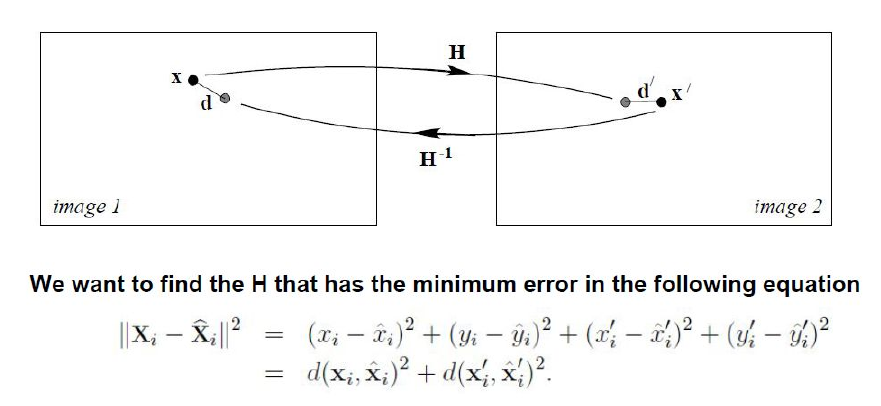

# Assignment 2

This was my 2nd assignment for the Computer Vision subject. In this assignment, instead of using the  DLT technique to find the homography matrix, the optimization technique is used and homography matrix is obtained. The cost function to used is illustrated in the following figure.

We have to minimize this cost.
In order to minimize the cost functions provided in the `scipy` are used.

## Requirements
This is a python3 based code that has been tested on python 3.5. Additionally it requires following libraries: -

 - Numpy
 - OpenCV
 - Matplotlib

## Explaination

In order to use this project, you need two images captured with the same camera with same centre point. Let's call these images `image-left` and `image-right`. You can specify these two images in line no. 119 and 120 in the file `assignment-1.py`. After you have specified them, run the file. The two images would appear, I have hard coded some points for the given images (line no 163-166), you can use them. With the images on screen, press the key `c` on the keyboard and the panoram will be calculated/appear
Else, if you want to manually specify the points, commment out the line no 163-166 and run the project. Select you corresponding points from the two images. After selecting points, press `c` to make panorama.
>***Note:*** It is assumed that you would select the points on right image/view using right mouse click and the one on the left image/view with the left mouse click, else problems will appear. Moreover, only the four most recent points of each image view would be stored, the earlier ones would be discarded.
***PS:*** I did not write the code for functions `merge_images` and `get_offset` all by myself. I got help from some github repository and I can't remember which one was it exactly.

You can read about calculating the homography matrix [here](https://sites.google.com/a/mines.sdsmt.edu/johnscomputervision/home/project-2/manual-image-stitching)
